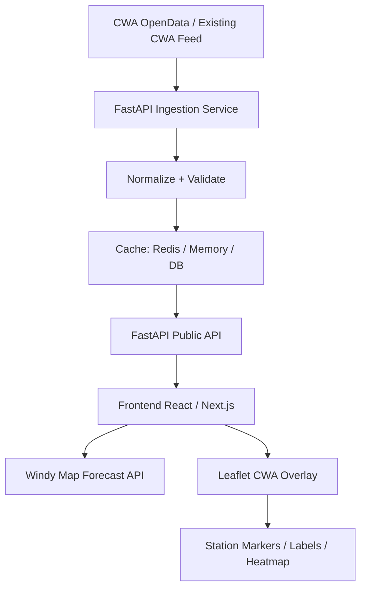

# Design: CWA Temperature Broadcast Visualization with Windy API

## 1. Project Overview

This project visualizes Taiwan CWA temperature broadcast / observation data on top of a Windy weather map.

The system uses:

* **CWA OpenData** as the trusted weather observation source.
* **FastAPI** as the backend API and data-normalization layer.
* **Windy Map Forecast API** as the interactive weather-map background.
* **Leaflet overlay layers** to render custom CWA temperature data on top of Windy.

Windy’s Map Forecast API is based on Leaflet 1.4.x, and Windy’s own documentation states that the Windy map object is a Leaflet map instance. This means we can use normal Leaflet features to draw our own CWA markers, labels, popups, and heatmap layers on top of the Windy map.

---

## 2. Goal

Build a real-time or near-real-time Taiwan temperature visualization system.

The first version should support:

1. Displaying a Windy map centered on Taiwan.
2. Loading latest CWA temperature observations from backend API.
3. Drawing CWA station temperatures as colored map markers.
4. Showing station name, county, town, temperature, humidity, wind, and observation time in popups.
5. Refreshing data automatically.
6. Providing a simple legend for temperature color ranges.
7. Allowing the user to switch Windy background layers, such as wind, rain, clouds, or temperature.

---

## 3. Why Windy + Leaflet

Windy should be treated as the **weather context layer**, not as the storage or rendering engine for our CWA data.

Windy gives us:

* Professional-looking weather-map background.
* Built-in weather overlays.
* Map controls.
* Forecast/weather context.
* Wind, rain, cloud, and temperature model layers.

Leaflet gives us:

* Custom station markers.
* Custom CWA temperature labels.
* Popups.
* GeoJSON support.
* Layer groups.
* Future heatmap or canvas overlays.

Windy’s documentation says the Map Forecast API lets developers customize Windy map visualizations with their own content and imagery, and that the map itself provides interactivity such as zooming, dragging, moving, and click handling.

---

## 4. Data Source

### 4.1 CWA Observation Data

The CWA automatic weather station dataset includes fields such as:

* `StationName`
* `StationId`
* `DateTime`
* `StationLatitude`
* `StationLongitude`
* `StationAltitude`
* `CountyName`
* `TownName`
* `Weather`
* `Precipitation`
* `WindDirection`
* `WindSpeed`
* `AirTemperature`
* `RelativeHumidity`
* `AirPressure`
* `PeakGustSpeed`

The dataset update frequency is every 1 hour and is published under Taiwan’s Open Government Data License, version 1.0.

### 4.2 Backend Responsibility

The frontend should not directly depend on the raw CWA format.

The backend should:

1. Fetch or receive CWA data.
2. Normalize field names.
3. Remove invalid records.
4. Convert strings to numbers.
5. Cache the latest result.
6. Expose clean JSON APIs for the frontend.

---

## 5. Architecture



---

## 6. Recommended Tech Stack

### Backend

* Python 3.11+
* FastAPI
* httpx
* Pydantic
* APScheduler or cron job
* Redis cache, optional
* PostgreSQL/PostGIS, optional for historical data

### Frontend

* Next.js or Vite + React
* Windy Map Forecast API
* Leaflet
* TypeScript
* Optional: Leaflet.markercluster
* Optional: Leaflet.heat or custom Canvas layer

---

## 7. Backend Design

### 7.1 Main Backend Modules

```text
backend/
  app/
    main.py
    config.py
    routers/
      temperature.py
      health.py
    services/
      cwa_client.py
      temperature_service.py
      cache_service.py
    schemas/
      temperature.py
    jobs/
      refresh_cwa_data.py
```

---

## 8. Backend Data Model

### 8.1 Normalized Temperature Observation

```python
from pydantic import BaseModel
from datetime import datetime

class StationTemperature(BaseModel):
    station_id: str
    station_name: str
    county: str | None = None
    town: str | None = None

    lat: float
    lon: float
    altitude_m: float | None = None

    observed_at: datetime
    temperature_c: float

    humidity_percent: float | None = None
    pressure_hpa: float | None = None
    wind_speed_mps: float | None = None
    wind_direction_deg: float | None = None
    precipitation_mm: float | None = None
    weather: str | None = None
```

---

## 9. Backend API Endpoints

### 9.1 Latest Temperature

```http
GET /api/temperature/latest
```

Returns all valid latest station observations.

Response:

```json
{
  "source": "CWA",
  "updated_at": "2026-07-02T09:00:00+08:00",
  "count": 1200,
  "stations": [
    {
      "station_id": "466920",
      "station_name": "臺北",
      "county": "臺北市",
      "town": "中正區",
      "lat": 25.0377,
      "lon": 121.5149,
      "observed_at": "2026-07-02T09:00:00+08:00",
      "temperature_c": 32.4,
      "humidity_percent": 67,
      "wind_speed_mps": 2.1
    }
  ]
}
```

### 9.2 GeoJSON Temperature Layer

```http
GET /api/temperature/geojson
```

Returns data in GeoJSON format for Leaflet.

```json
{
  "type": "FeatureCollection",
  "features": [
    {
      "type": "Feature",
      "geometry": {
        "type": "Point",
        "coordinates": [121.5149, 25.0377]
      },
      "properties": {
        "station_id": "466920",
        "station_name": "臺北",
        "temperature_c": 32.4,
        "county": "臺北市",
        "town": "中正區",
        "observed_at": "2026-07-02T09:00:00+08:00"
      }
    }
  ]
}
```

### 9.3 Station Detail

```http
GET /api/temperature/stations/{station_id}
```

Returns latest detail for one station.

### 9.4 Health Check

```http
GET /api/health
```

Response:

```json
{
  "status": "ok",
  "cwa_cache_status": "fresh",
  "latest_cwa_time": "2026-07-02T09:00:00+08:00"
}
```

---

## 10. Data Validation Rules

Backend should remove or ignore records when:

1. Latitude or longitude is missing.
2. Temperature is missing.
3. Temperature cannot be parsed as number.
4. Temperature is outside a reasonable range, for example `< -20°C` or `> 50°C`.
5. Station ID is missing.
6. Observation time is invalid.

Use configurable invalid-value rules because CWA datasets may encode missing values differently depending on product.

Example:

```python
INVALID_VALUES = {"", "X", "NA", "null", None, "-99", "-999"}

def parse_float(value):
    if value in INVALID_VALUES:
        return None
    try:
        return float(value)
    except ValueError:
        return None
```

---

## 11. Frontend Design

### 11.1 Frontend Structure

```text
frontend/
  src/
    components/
      WindyMap.tsx
      TemperatureLayer.tsx
      TemperatureLegend.tsx
      StationPopup.tsx
      LayerControlPanel.tsx
    lib/
      windyLoader.ts
      cwaApi.ts
      colorScale.ts
    types/
      temperature.ts
```

---

## 12. Windy Map Initialization

Windy’s hello-world tutorial requires loading Leaflet first, then loading Windy’s `libBoot.js`. The application must contain a `div` where Windy is mounted, and `windyInit(options, callback)` is used to initialize the API.

Example:

```html
<script src="https://unpkg.com/leaflet@1.4.0/dist/leaflet.js"></script>
<script src="https://api.windy.com/assets/map-forecast/libBoot.js"></script>

<div id="windy"></div>
```

```js
const options = {
  key: WINDY_API_KEY,
  lat: 23.7,
  lon: 121.0,
  zoom: 7,
  overlay: "wind",
  verbose: true
};

windyInit(options, windyAPI => {
  const { map, store } = windyAPI;

  store.set("overlay", "wind");

  // Add CWA layer here
});
```

---

## 13. Windy Layer Control

Windy map parameters such as `overlay`, `level`, `timestamp`, `product`, and particle animation are controlled through `windyAPI.store`. The API supports `.get()`, `.set()`, and `.getAllowed()` for controlling these parameters.

Recommended default:

```js
store.set("overlay", "wind");
store.set("particlesAnim", "on");
```

Useful overlay options:

```js
const overlays = [
  "wind",
  "temp",
  "rain",
  "clouds"
];
```

Important design choice:

* Windy `temp` layer = Windy/model temperature visualization.
* CWA overlay = actual CWA station observation layer.

Do not confuse these two.

---

## 14. CWA Temperature Layer

### 14.1 Marker Layer

Use a Leaflet `LayerGroup` for station markers.

```js
let cwaLayer = L.layerGroup().addTo(map);

async function loadCwaTemperature() {
  const res = await fetch("/api/temperature/latest");
  const data = await res.json();

  cwaLayer.clearLayers();

  data.stations.forEach(station => {
    const marker = L.circleMarker([station.lat, station.lon], {
      radius: getRadius(station.temperature_c),
      fillColor: colorByTemperature(station.temperature_c),
      fillOpacity: 0.85,
      color: "#ffffff",
      weight: 1
    });

    marker.bindPopup(`
      <strong>${station.station_name}</strong><br/>
      ${station.county ?? ""} ${station.town ?? ""}<br/>
      Temperature: ${station.temperature_c}°C<br/>
      Humidity: ${station.humidity_percent ?? "-"}%<br/>
      Wind: ${station.wind_speed_mps ?? "-"} m/s<br/>
      Time: ${station.observed_at}
    `);

    marker.addTo(cwaLayer);
  });
}
```

---

## 15. Temperature Color Scale

Recommended color scale:

```ts
export function colorByTemperature(temp: number): string {
  if (temp < 10) return "#2b6cb0";
  if (temp < 15) return "#3182ce";
  if (temp < 20) return "#38a169";
  if (temp < 25) return "#ecc94b";
  if (temp < 30) return "#ed8936";
  if (temp < 35) return "#e53e3e";
  return "#9b2c2c";
}
```

Legend:

```text
< 10°C       cold
10–15°C      cool
15–20°C      mild
20–25°C      comfortable
25–30°C      warm
30–35°C      hot
> 35°C       very hot
```

---

## 16. Auto Refresh

Since CWA automatic weather station data is updated hourly, the frontend can refresh every 5–10 minutes while the backend cache refreshes hourly or slightly more often.

Recommended behavior:

```text
Backend refresh interval: every 10 minutes
Frontend refresh interval: every 5 minutes
Displayed status: latest CWA observation time
```

The frontend should always display:

```text
Last CWA update: YYYY-MM-DD HH:mm
```

---

## 17. Windy Event Handling

Windy broadcasts events such as:

* `mapChanged`
* `paramsChanged`
* `redrawFinished`
* `metricChanged`
* `uiChanged`

The `redrawFinished` event is useful when running custom tasks after Windy finishes loading and rendering data.

Example:

```js
windyAPI.broadcast.on("redrawFinished", () => {
  console.log("Windy redraw finished");
});
```

Avoid running heavy rendering logic directly on `paramsChanged`.

---

## 18. Performance Design

### 18.1 Small Dataset

If the station count is under 1,500:

* Use `L.circleMarker`.
* Use one `LayerGroup`.
* Refresh by clearing and redrawing markers.

### 18.2 Larger Dataset

If the number of points grows:

* Use marker clustering.
* Use Canvas renderer.
* Use simplified label display.
* Hide labels at low zoom levels.
* Render text labels only when zoom >= 9.

### 18.3 Heatmap Mode

For heatmap visualization:

* Start with station-point heatmap.
* Later, use gridded CWA data if available.
* Do not overclaim interpolated station data as exact ground truth.

---

## 19. UI Design

Main layout:

```text
┌─────────────────────────────────────────────┐
│ Top Bar                                     │
│ CWA Temperature Broadcast | Last update     │
├─────────────────────────────────────────────┤
│                                             │
│              Windy Map                      │
│      + CWA Temperature Overlay              │
│                                             │
├───────────────┬─────────────────────────────┤
│ Legend        │ Layer Control               │
│ Temp colors   │ Windy layer / CWA layer     │
└───────────────┴─────────────────────────────┘
```

Controls:

1. CWA overlay on/off.
2. Show station labels on/off.
3. Windy layer selector.
4. Auto refresh on/off.
5. County filter.
6. Temperature threshold filter.

---

## 20. Environment Variables

### Backend

```env
CWA_API_KEY=your_cwa_api_key
CWA_DATA_URL=your_cwa_data_url
CACHE_TTL_SECONDS=600
```

### Frontend

```env
NEXT_PUBLIC_WINDY_API_KEY=your_windy_api_key
NEXT_PUBLIC_API_BASE_URL=http://localhost:8000
```

Note:

The Windy browser key is client-visible in frontend code. The CWA key should stay server-side.

---

## 21. Security

1. Do not expose the CWA API key to the browser.
2. Restrict allowed origins on FastAPI.
3. Add rate limiting for public APIs.
4. Cache CWA data to avoid unnecessary upstream requests.
5. Do not store secrets in Git.
6. Add `.env.example`, but never commit `.env`.

---

## 22. Error Handling

### Backend Errors

If CWA fetch fails:

```json
{
  "status": "stale",
  "message": "Using cached data because CWA fetch failed.",
  "latest_cwa_time": "2026-07-02T09:00:00+08:00"
}
```

### Frontend Errors

Show friendly UI:

```text
CWA data is temporarily unavailable.
Showing the latest cached observation.
```

If Windy fails:

```text
Weather map failed to load.
CWA station data is still available in table mode.
```

---

## 23. Development Phases

### Phase 1: MVP

* FastAPI endpoint: `/api/temperature/latest`
* Windy map centered on Taiwan
* CWA station markers
* Temperature legend
* Popup detail
* Manual refresh button

### Phase 2: Dashboard

* Auto refresh
* County filter
* Station search
* Windy layer switcher
* Station label toggle
* Health check endpoint

### Phase 3: Advanced Visualization

* Heatmap mode
* Time slider
* Historical playback
* Gridded temperature layer
* Alert threshold coloring
* Mobile-friendly UI

### Phase 4: Production

* Redis cache
* Postgres/PostGIS
* API rate limiting
* Logging
* Monitoring
* Deployment to Vercel + Render/Fly.io/Railway, or self-hosted server

---

## 24. Acceptance Criteria

### MVP Acceptance Criteria

The system is complete when:

1. User can open the page and see a Windy map.
2. Map is centered on Taiwan.
3. CWA station temperature markers appear on the map.
4. Marker color changes according to temperature.
5. Clicking a marker shows station detail.
6. User can see the latest CWA observation time.
7. User can refresh CWA data.
8. Backend hides the CWA API key.
9. Frontend does not crash if CWA data is missing.
10. The project includes clear setup instructions.

---

## 25. Suggested File Structure

```text
cwa-windy-temperature/
  README.md
  design.md
  backend/
    app/
      main.py
      config.py
      routers/
        temperature.py
        health.py
      services/
        cwa_client.py
        temperature_service.py
        cache_service.py
      schemas/
        temperature.py
    requirements.txt
    .env.example
  frontend/
    src/
      components/
        WindyMap.tsx
        TemperatureLayer.tsx
        TemperatureLegend.tsx
        LayerControlPanel.tsx
      lib/
        cwaApi.ts
        colorScale.ts
        windyLoader.ts
      types/
        temperature.ts
    package.json
    .env.example
```

---

## 26. Implementation Notes

### Backend

Use FastAPI to hide upstream CWA complexity.

```python
@app.get("/api/temperature/latest")
async def get_latest_temperature():
    data = await temperature_service.get_latest()
    return data
```

### Frontend

Initialize Windy once.

Do not create multiple Windy map instances on the same page.

Keep CWA marker rendering separate from Windy initialization.

```ts
type WindyApi = {
  map: any;
  store: any;
  broadcast: any;
};
```

---

## 27. Main Technical Decision

Use this design:

```text
Windy Map Forecast API
  → provides base weather map and weather context

Leaflet custom overlay
  → renders CWA station temperature data

FastAPI
  → fetches, cleans, validates, caches, and serves CWA data
```

This is better than trying to inject CWA data into Windy’s native `temp` overlay.

---

## 28. Future Ideas

1. Compare CWA observed temperature vs Windy model temperature.
2. Show station anomalies.
3. Show top 10 hottest stations.
4. Show county average temperature.
5. Add typhoon/rain/wind overlay mode.
6. Add voice broadcast mode:

   * “Current hottest area is Tainan, 35.2°C.”
   * “Northern Taiwan is around 31–33°C.”
7. Add classroom mode:

   * Students can inspect observation data.
   * Compare station vs model.
   * Learn interpolation and weather visualization.

---

## 29. References

Windy Map Forecast API is based on Leaflet 1.4.x and allows developers to customize Windy map visualizations with their own content and imagery.

Windy initialization requires Leaflet and Windy’s `libBoot.js`, and the callback provides the Windy API object including the Leaflet map instance.

Windy map parameters such as overlay, level, timestamp, product, and particles can be controlled through `windyAPI.store`.

Windy broadcasts events such as `mapChanged`, `paramsChanged`, and `redrawFinished`, which can be used for map interaction and rendering coordination.

CWA automatic weather station data includes station metadata and observation fields such as air temperature, humidity, pressure, wind speed, precipitation, latitude, and longitude. The dataset update frequency is every 1 hour.
