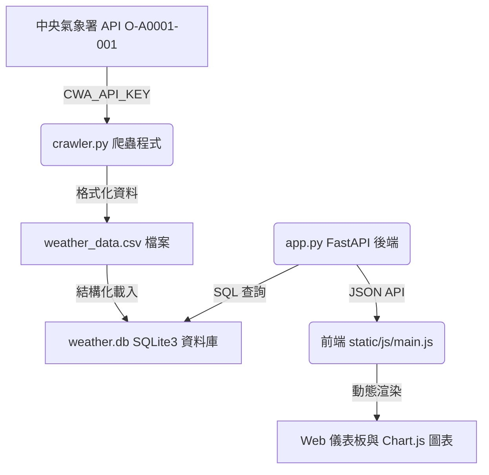

# 臺灣即時氣象觀測儀表板 (HW-10 - FastAPI)

本專案是一個利用 Python 自動爬取中央氣象署（CWA）觀測站數據的 Web 應用程式。抓取到的數據會先儲存為 CSV 格式，接著寫入 SQLite3 資料庫中，最後透過 FastAPI 後端伺服器與具備玻璃擬態（Glassmorphism）質感的現代化前端介面進行視覺化呈現。

## 系統架構與資料流



## 功能特點

1. **即時數據爬網**：自中央氣象署爬取全台 870+ 個觀測站的氣溫、濕度、風速、雨量等觀測數據。
2. **多重儲存備份**：
   - 存入結構化的 [weather_data.csv](weather_data.csv) 方便資料分析。
   - 存入 [weather.db](weather.db) SQLite3 資料庫以實現高效的關係型查詢。
3. **精美暗色系 UI**：採用玻璃擬態 (Glassmorphism) 與霓虹光感設計，提供流暢的微動畫與自適應佈局。
4. **數據統計與聚合**：自動計算各縣市的平均氣溫、平均濕度、日極端溫度以及累積雨量。
5. **Chart.js 互動圖表**：以直觀的柱狀圖與折線圖呈現各縣市的溫度與濕度對比。
6. **詳細觀測清單 (Modal)**：點擊縣市卡片可開啟 Modal 彈窗，詳細檢視該縣市內所有測站的即時數據明細。

## 專案結構

- [app.py](app.py)：FastAPI Web 伺服器與 API 提供者。
- [crawler.py](crawler.py)：CWA 氣象資料爬蟲、CSV 寫入器與 SQLite3 匯入器。
- [requirements.txt](requirements.txt)：專案相依套件清單。
- [templates/](templates/)
  - [index.html](templates/index.html)：首頁模板。
- [static/](static/)
  - [css/style.css](static/css/style.css)：全域暗色系玻璃擬態樣式表。
  - [js/main.js](static/js/main.js)：前端渲染、互動與 Chart.js 圖表邏輯。
- [.env](.env)：存放氣象署 API 金鑰的設定檔。

## 安裝與執行步驟

### 1. 安裝依賴套件
在專案根目錄下執行以下指令安裝所需套件：
```bash
pip install -r requirements.txt
```

### 2. 設定 API 金鑰
本專案已在 [.env](.env) 檔案中設定您的中央氣象署授權碼：
```env
CWA_API_KEY=CWA-55FDA6D3-A43C-4AE0-BB30-E62D5F684FB2
```

### 3. 啟動伺服器
使用 Uvicorn 執行 FastAPI 應用程式：
```bash
uvicorn app:app --reload --port 5000
```
啟動後，FastAPI 會在啟動時自動檢測並先執行一遍 `crawler.py`，下載最新數據並建立 `weather_data.csv` 與 `weather.db`。

### 4. 開啟瀏覽器
打開瀏覽器並前往 `http://127.0.0.1:5000` 即可開始使用氣象儀表板。
