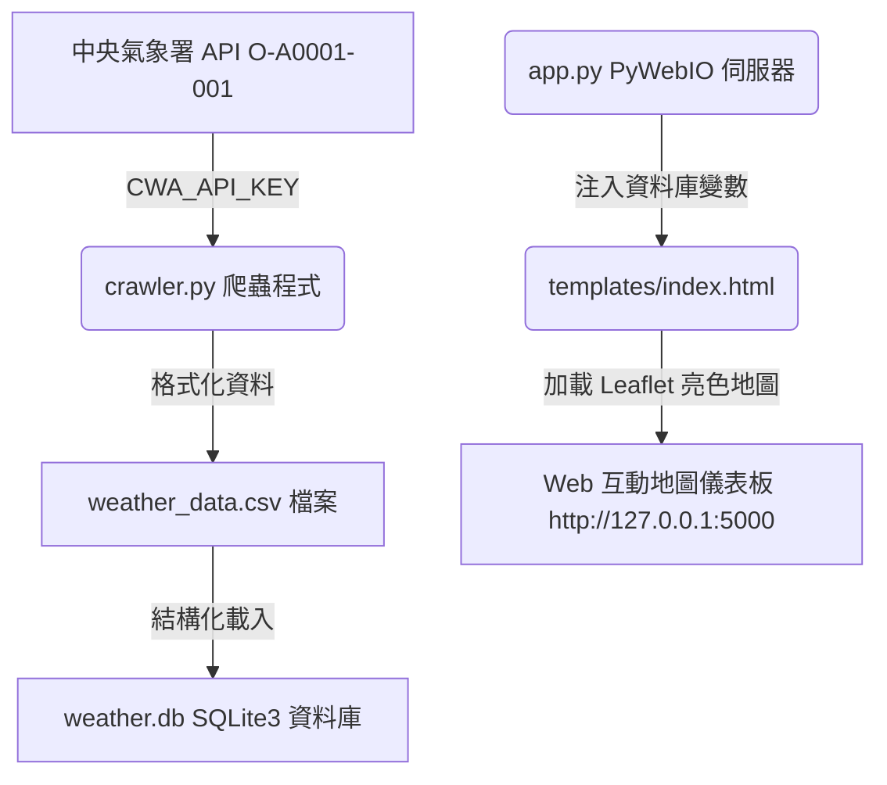

# DEMO: http://127.0.0.1:5000

# 臺灣即時氣象觀測儀表板 (HW-10 - PyWebIO)

本專案是一個利用 Python 自動爬取中央氣象署（CWA）觀測站數據的 Web 應用程式。抓取到的數據會先儲存為 CSV 格式，接著寫入 SQLite3 資料庫中，最後透過 **PyWebIO** 後端伺服器與具備玻璃擬態（Glassmorphism）質感的現代化 Leaflet 互動地圖介面進行視覺化呈現。

## 系統架構與資料流



## 功能特點

1. **即時數據爬網**：自中央氣象署爬取全台 820+ 個觀測站的氣溫、濕度、風速、雨量等觀測數據。
2. **多重儲存備份**：
   - 存入結構化的 [weather_data.csv](weather_data.csv) 方便資料分析。
   - 存入 [weather.db](weather.db) SQLite3 資料庫以實現高效查詢。
3. **白藍亮色系視覺 UI**：採用極簡清新的天空藍白漸層背景與白色玻璃擬態 (White Glassmorphism) 設計，提供出色的文字對比度。
4. **Leaflet 互動式氣象地圖**：
   - **底圖切換與氣象模擬**：在本地無 Windy 金鑰的 Leaflet 模式下，支援切換風速、氣溫、降雨、雲量選項。
   - **動態降雨雷達**：切換為降雨時，會非同步串接 RainViewer 雷達 API 渲染台灣即時雷達回波疊加層！
5. **手動同步更新**：點選同步按鈕，將由 PyWebIO 後端觸發 Python 爬蟲進行重新整理並重載網頁。

## 專案結構

- [app.py](app.py)：PyWebIO 網頁伺服器與 session 控制器。
- [crawler.py](crawler.py)：CWA 氣象資料爬蟲、CSV 寫入器與 SQLite3 匯入器。
- [requirements.txt](requirements.txt)：專案相依套件清單（加入 `pywebio` 移出 `fastapi`）。
- [templates/](templates/)
  - [index.html](templates/index.html)：首頁模板（支援 FastAPI/PyWebIO 雙模式載入）。
- [static/](static/)
  - [css/style.css](static/css/style.css)：全域白藍亮色系玻璃擬態樣式表。
  - [js/main.js](static/js/main.js)：前端地圖渲染與 PyWebIO 互動橋接邏輯。
- [.env](.env)：存放氣象署 API 金鑰的設定檔。
- [.env.example](.env.example)：設定檔範例。

## 安裝與執行步驟

### 1. 安裝依賴套件
在專案根目錄下執行以下指令安裝所需套件：
```bash
pip install -r requirements.txt
```

### 2. 設定 API 金鑰
本專案已在 [.env](.env) 檔案中設定您的中央氣象署授權碼：
```env
CWA_API_KEY=CWA-55FDA6D3-A43C-4AE0-BB30-E62D5F684FB2
```

### 3. 啟動伺服器
直接執行 Python 應用程式啟動 PyWebIO 伺服器：
```bash
python app.py
```
伺服器將在 `http://127.0.0.1:5000` 啟動，並在啟動時自動檢測並執行一遍 `crawler.py`。

### 4. 開啟瀏覽器
開啟瀏覽器並前往 `http://127.0.0.1:5000` 即可開始使用氣象儀表板。
