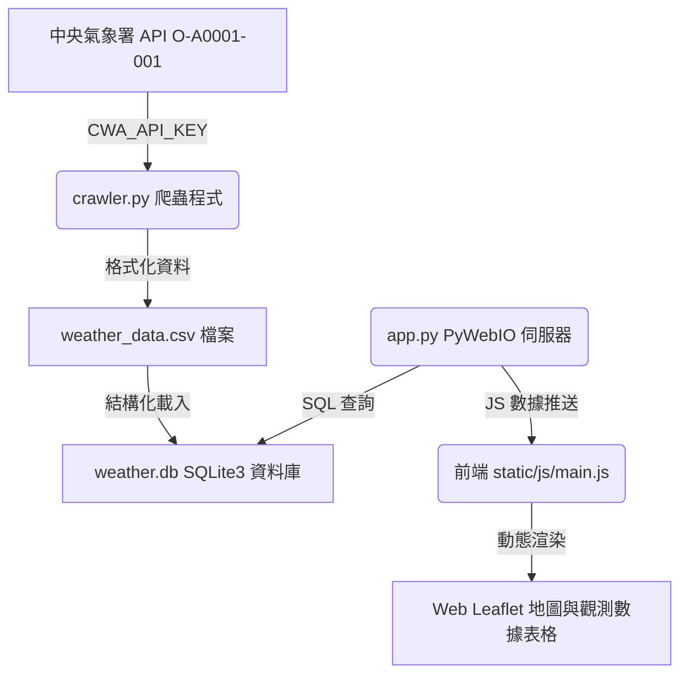

# 臺灣即時氣象觀測儀表板 (HW-10 - PyWebIO)

本專案是一個利用 Python 自動爬取中央氣象署（CWA）觀測站數據的 Web 應用程式。抓取到的數據會先儲存為 CSV 格式，接著寫入 SQLite3 資料庫中，最後透過 **PyWebIO** 網頁框架與具備玻璃擬態（Glassmorphism）質感的現代化前端介面進行視覺化呈現。

## 系統架構與資料流



## 功能特點

1. **即時數據爬網**：自中央氣象署爬取全台 820+ 個觀測站的氣溫、濕度、風速、雨量等觀測數據。
2. **多重儲存備份**：
   - 存入結構化的 [weather_data.csv](weather_data.csv) 方便資料分析。
   - 存入 [weather.db](weather.db) SQLite3 資料庫以實現高效的關係型查詢。
3. **清爽白藍亮色系 UI**：採用白藍天空漸層背景與白色玻璃擬態 (White Glassmorphism) 設計，提供現代、簡潔的視覺體驗。
4. **Leaflet 台灣氣象地圖**：
   - 氣溫彩色圓點標記與溫度數值標籤在白底圖資（CartoDB Positron）上清晰顯示。
   - 支援風速、氣溫、降雨（RainViewer 即時降雨雷達）、雲量等背景氣象層變換。
5. **數據統計與極值排行**：自動統計高溫與低溫排行榜 Top 5。
6. **詳細觀測數據表格**：提供摺疊式的詳細表格，可依測站、縣市名稱即時搜尋過濾。

## 專案結構

- [app.py](app.py)：PyWebIO 獨立 Web 伺服器，負責與瀏覽器 WebSocket 連接並推送數據。
- [crawler.py](crawler.py)：CWA 氣象資料爬蟲、CSV 寫入器與 SQLite3 匯入器。
- [requirements.txt](requirements.txt)：專案相依套件清單（配置為 PyWebIO）。
- [templates/](templates/)
  - [index.html](templates/index.html)：首頁模板（與 PyWebIO 搭配使用）。
- [static/](static/)
  - [css/style.css](static/css/style.css)：亮色系白藍玻璃擬態樣式表。
  - [js/main.js](static/js/main.js)：前端地圖渲染、篩選與 PyWebIO Pin 連動邏輯。
- [.env](.env)：存放氣象署 API 金鑰的設定檔。

## 安裝與執行步驟

### 1. 安裝依賴套件
在專案根目錄下執行以下指令安裝所需套件：
```bash
pip install -r requirements.txt
```

### 2. 設定 API 金鑰
本專案已在 [.env](.env) 檔案中設定您的中央氣象署授權碼：
```env
CWA_API_KEY=CWA-55FDA6D3-A43C-4AE0-BB30-E62D5F684FB2
```

### 3. 啟動伺服器
直接以 Python 執行 `app.py`：
```bash
python app.py
```
啟動後，PyWebIO 伺服器會在啟動時自動檢測並執行 `crawler.py`，下載最新數據並建立 `weather_data.csv` 與 `weather.db`。

### 4. 開啟瀏覽器
打開瀏覽器並前往 **`http://127.0.0.1:5000`** 即可開始使用 PyWebIO 氣象儀表板。
